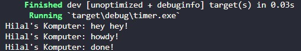

# **Rust Tutorial & Exercise**
**Muhammad Hilal Darul Fauzan** 
**2206830542** 
**Pemrograman Lanjut C** 

## **Tutorial Modul 10: Asynchronous Programming**

### 1.2. Understanding how it works

  
Berdasarkan gambar di atas, terlihat bahwa output pertama yang muncul adalah "Hilal's Komputer: hey hey!". Hal ini terjadi karena baris tersebut dijalankan sebelum `drop(spawner)` dan `executor.run()`, yang berarti pesan tersebut dicetak sebelum task yang di-spawn mulai diproses oleh executor. Ketika executor dijalankan, task yang sebelumnya sudah di-spawn baru mulai bekerja, kemudian output menampilkan "Hilal's Komputer: howdy!" dan dengan selang waktu 2 detik, menampilkan "Hilal's Komputer: done!". Jadi, kesimpulannya "Hilal's Komputer: hey hey!" muncul pertama karena dieksekusi langsung di thread utama sebelum executor menjalankan task-task asinkron yang telah di-spawn.