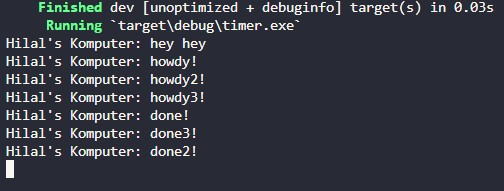
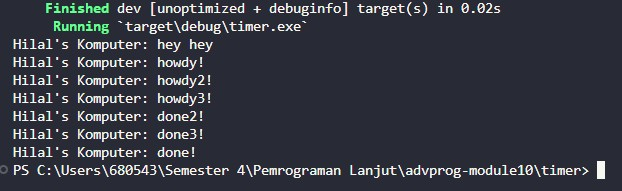
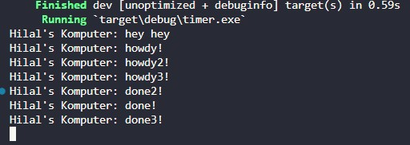

# **Rust Tutorial & Exercise**
**Muhammad Hilal Darul Fauzan** 
**2206830542** 
**Pemrograman Lanjut C** 

## **Tutorial Modul 10: Asynchronous Programming**

### 1.2. Understanding how it works

  
Berdasarkan gambar di atas, terlihat bahwa output pertama yang muncul adalah "Hilal's Komputer: hey hey!". Hal ini terjadi karena baris tersebut dijalankan sebelum `drop(spawner)` dan `executor.run()`, yang berarti pesan tersebut dicetak sebelum task yang di-spawn mulai diproses oleh executor. Ketika executor dijalankan, task yang sebelumnya sudah di-spawn baru mulai bekerja, kemudian output menampilkan "Hilal's Komputer: howdy!" dan dengan selang waktu 2 detik, menampilkan "Hilal's Komputer: done!". Jadi, kesimpulannya "Hilal's Komputer: hey hey!" muncul pertama karena dieksekusi langsung di thread utama sebelum executor menjalankan task-task asinkron yang telah di-spawn.

### 1.3. Multiple Spawn and removing drop

  
  
  
Berdasarkan ketiga gambar di atas, terlihat adanya beberapa task yang dijadwalkan untuk dijalankan melalui spawner dan sebuah executor yang bertanggung jawab dalam mengelola eksekusi task-task tersebut. Terdapat perbedaan ketika `drop(spawner)` digunakan dan ketika baris tersebut di-comment. Jika `drop(spawner)` digunakan, maka executor akan mengetahui bahwa tidak akan ada lagi task baru yang masuk, sehingga executor dapat berhenti setelah menjalankan semua task yang ada dalam antrian. Sebaliknya, jika `drop(spawner)` di-comment, executor tidak akan mendapatkan konfirmasi bahwa semua task telah selesai, sehingga menyebabkan executor terus berjalan menunggu task baru yang tidak akan pernah datang.

Dari ketiga output pada gambar tersebut, dapat terlihat juga bahwa urutan output "done" dapat berbeda-beda. Hal ini terjadi karena setiap task memiliki selang waktu tunggu yang sama yaitu 2 detik, sehingga urutan eksekusi setelah selang waktu tersebut bergantung pada bagaimana executor menjadwalkan task-task tersebut. Executor dapat menjalankan task dalam urutan yang tidak terduga karena asynchronous nature dan concurrency dari sistem.